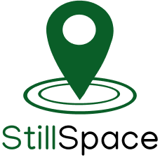

# Android Application

Android application which shows study space "hotspots" and current usage, crowdsourced from students who are currently studying in the area.

## Setup

### Android

Install [Android Studio](https://developer.android.com/studio/).

#### Creating a Production Release

Save the following lines to the file `~/.gradle/gradle.properties` and fill in the values:
```
STILLSPACE_KEY_STORE_FILE=/path/to/keystore.jks
STILLSPACE_KEY_ALIAS=
STILLSPACE_KEY_PASSWORD=
STILLSPACE_STORE_PASSWORD=
```
